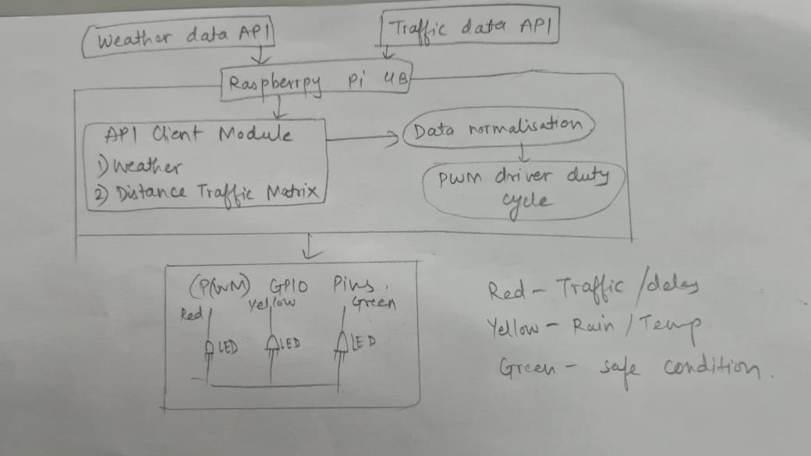
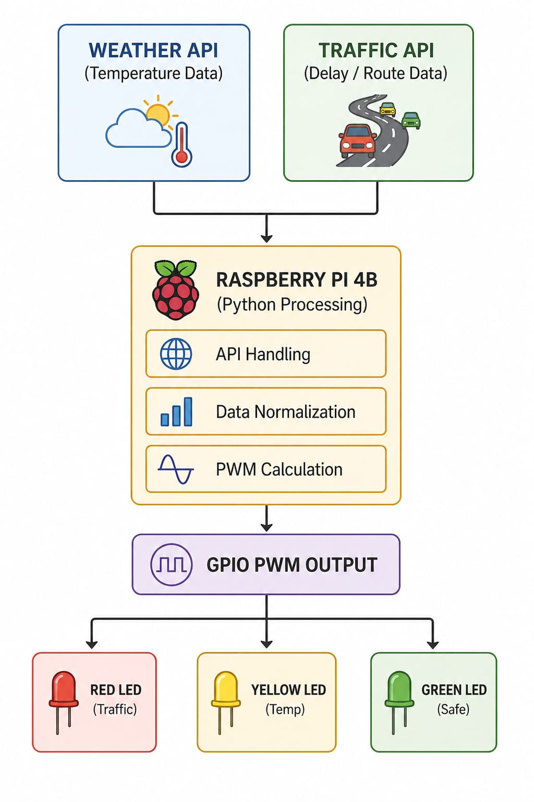
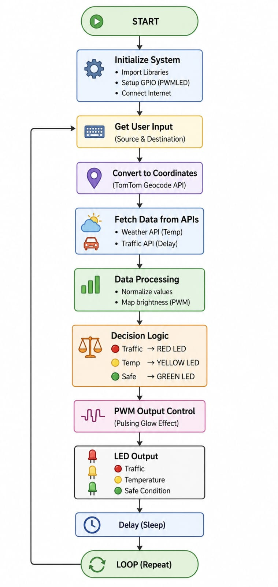

# SKILL LAB PRATICAL HACKATHON

## Final Project README

1. Team Identity

1.1 Studio / Group Name :- ElectroBoom

1.2 Team Members

| **Name** | **Primary Role** | **Secondary Role** | **Strengths Brought to the Project** |
| --- | --- | --- | --- |
| Kalpesh Naik (Team Leader) | Logical Thinking, Software, Electronics | Testing, Integration | Circuit design, hardware debugging, Software , API integration |
| Shikhar Swarup | Coding, Software, Hardware | API Integration | Software, Python programming |
| Sonali Parishwad | Documentation | Debugging, Coordination | Structured writing, organization |
| Ayush Kumar Sahu | Documentation | Testing | Debugging |

## 1.3 Project Title

Pulsing Glow – Real-Time IoT LED Data Gauge

## 1.4 One-Line Pitch

A Raspberry Pi-based system that converts real-time weather and traffic data into LED brightness for instant ambient awareness.

## 1.5 Expanded Project Idea

This project presents a novel way of visualizing real-time data without using screens or graphical interfaces. Instead of relying on mobile applications or dashboards, the system uses LED brightness as a medium to communicate information.

The Raspberry Pi continuously fetches rain probability data from a weather API and traffic delay data from a mapping API. These values are processed and mapped to Pulse Width Modulation (PWM) signals, which control the brightness of three LEDs. Each LED represents a specific condition: red for traffic intensity, yellow for rain probability, and green for overall safe conditions.

The objective is not to provide detailed numerical data but to enable instant understanding. By simply observing the brightness levels, users can quickly interpret real-world conditions. This transforms interaction from an active process, such as checking a phone, into a passive experience where information is continuously available in the background.

---

# 2. Inspiration

Ambient Computing — Smart systems that provide information passively, without direct user interaction.

Traffic Signal Systems — Using color and intensity to convey critical information instantly.

IoT Data Systems — Collecting and processing real-time data from external APIs.

Minimal Interface Devices — Fitness bands and indicators that use simple visual cues instead of screens.

## 2.1 References

List what inspired the project.

| **Source Type** | **Title / Link** | **What Inspired You** |
| --- | --- | --- |
| **API** | [TomTom Developer Distance Matrix API](https://developer.tomtom.com/routing-api/documentation/tomtom-maps/product-information/introduction) | Extracting real-time traffic delays between origins and destinations to control the Red LED intensity. |
| **API** | [OpenWeatherMap API](https://openweathermap.org/api) | Fetching live rain probability parameters to map to the Yellow LED. |
| **Research Paper** | [From Screens to Ambient AI in the Emerging Post-Smartphone World (PDF)](https://puirp.com/index.php/research/article/download/121/105/114) | Insights on shifting from active mobile phone screen time to passive, ambient IoT awareness displays. |
| **Video Tutorial** | [PWM with Raspberry Pi 4 LED Brightness Control (YouTube)](https://www.youtube.com/watch?v=6KO-KPX3Riw) | Hardware setup and Python code logic for mapping numeric variables to PWM duty cycles for smooth brightness. |
| Concept | Ambient Computing | Passive data delivery without user interaction |
| Real-world System | Traffic Signals | Quick understanding through light indicators |
| Technology | IoT Systems | Real-time data acquisition and processing |

## 2.2 Original Twist

Most systems present data using dashboards, mobile applications, or numerical displays that require user attention and interpretation. This project eliminates the need for such interfaces by using physical light output as the primary communication medium.

The system represents real-time data through LED brightness, allowing users to interpret conditions instantly without reading or interacting. Higher brightness indicates higher intensity, while lower brightness indicates normal conditions. The originality lies in converting complex real-world data into a simple, intuitive, and continuously visible physical signal system that promotes passive awareness.

---

# 3. Project Intent

## 3.1 User Journey

When the system is powered on, the Raspberry Pi initializes all GPIO pins and performs a brief LED check to confirm proper functioning. After initialization, the system connects to the internet and begins executing the main program.

The device continuously fetches data from external APIs. Weather data is obtained to determine rain probability, and traffic data is retrieved to measure travel delays. This data is processed in real time and mapped to LED brightness levels using PWM.

The LEDs act as physical indicators of real-world conditions. The red LED becomes brighter with increasing traffic congestion, the yellow LED increases in brightness with higher rain probability, and the green LED represents safe conditions. From the user's perspective, interaction is minimal. The user only needs to observe the LEDs to understand the situation instantly. The system operates continuously, updating data at regular intervals, creating an ambient awareness environment.

---

# 4. Definition of Success

## 4.1 Definition of "Usable"

The system is considered usable when it operates continuously without manual intervention, successfully fetches real-time data, processes it accurately, and reflects it through LED brightness without errors or delays.

## 4.2 Minimum Usable Version

- Raspberry Pi controlling three LEDs using GPIO
- Successful integration with at least one API
- Basic mapping of data to LED brightness
- Continuous execution loop

## 4.3 Stretch Features

- Brightness smoothing to reduce fluctuations
- Support for multiple locations
- Optional web interface
- Data logging for analysis
- Error handling and retry mechanisms
- Enclosure for improved durability

---

# 5. System Overview

## 5.1 Project Type

- [x] Electronics-based
- [ ] Mechanical
- [ ] Sensor-based
- [ ] App-connected
- [ ] Motorized
- [ ] Sound-based
- [x] Light-based
- [ ] Screen/UI-based
- [ ] Fabricated structure
- [ ] Game logic based
- [ ] Installation
- [x] Other: API-driven IoT system

## 5.2 High-Level System Description

The system collects real-time data from online APIs, processes it within the Raspberry Pi, and represents it physically using LED brightness. Input is obtained from weather and traffic APIs. The Raspberry Pi processes this data using a Python script, which extracts relevant parameters and normalizes them. These values are then converted into PWM signals to control LED brightness. The output is purely physical, where LEDs dynamically change brightness to reflect real-world conditions. The system runs continuously in a loop, ensuring real-time updates.

## 5.3 Input / Output Map

| **System Part** | **Type** | **What It Does** |
| --- | --- | --- |
| Weather API | Input | Provides rain probability |
| Traffic API | Input | Provides traffic delay |
| Raspberry Pi | Processing | Executes logic and controls GPIO |
| Python Script | Processing | Handles data processing |
| LEDs | Output | Display conditions via brightness |
| Power Supply | Support | Provides system power |

---

# 6. System Design, Sketches and Visual Planning

## 6.1 Concept Architecture/sketch/schematic

**Concept Flow:** Internet APIs → Data Processing (Python on Raspberry Pi) → GPIO PWM Signals → LED Output

## 6.2 Labeled Build Sketch/architecture/flow diagram/algorithm

The physical setup consists of a Raspberry Pi connected to a breadboard. Three LEDs are placed on the breadboard, each connected to a GPIO pin through a resistor. All LEDs share a common ground. The user interacts with the system by observing LED brightness levels.

- structure,
- electronics placement,
- user touch points,
- moving parts,
- output elements.

## 6.3 Approximate Dimensions

| **Dimension** | **Value** |
| --- | --- |
| Length | 12 cm |
| Width | 10 cm |
| Height | 5 cm |
| Estimated weight | 300 g |

---

# 7. Electronics Planning

## 7.1 Electronics Used

| **Component** | **Quantity** | **Purpose** |
| --- | --- | --- |
| Raspberry Pi 4B | 1 | Main controller |
| LEDs (R, Y, G) | 3 | Output indicators |
| Resistors | 3 | Current limiting |
| Breadboard | 1 | Prototyping |
| Jumper Wires | Multiple | Connections |

## 7.2 Wiring Plan

GPIO17 controls the red LED, GPIO27 controls the yellow LED, and GPIO22 controls the green LED. Each LED is connected in series with a resistor to limit current. All LEDs share a common ground connected to the Raspberry Pi.

## 7.3 Circuit Diagram/architecture diagram

The circuit consists of GPIO pins (17, 27, 22) connected to the positive anodes of the Red, Yellow, and Green LEDs respectively via current-limiting resistors. All LED cathodes are connected to a common ground rail on the breadboard, which routes back to a physical GND pin on the Raspberry Pi.

## 7.4 Power Plan

| **Question** | **Response** |
| --- | --- |
| Power source | 5V USB supply |
| Voltage required | 3.3V GPIO output |
| Current concerns | Limited safely using resistors |
| Safety concerns | Ensure proper grounding and secure connections |

---

# 8. Software Planning

## 8.1 Software Tools

| **Tool / Platform** | **Purpose** |
| --- | --- |
| Python | Main programming |
| gpiozero | GPIO control |
| requests | API communication |
| Raspberry Pi OS | Execution platform |

## 8.2 Software Logic/Algorithm

The system initializes GPIO pins and sets up PWM control. It then fetches data from external APIs, extracts relevant values (weather probability, traffic delays), normalizes them, and adjusts LED brightness accordingly based on severity. The system runs continuously in a loop with periodic updates to maintain real-time accuracy.

**● Startup behavior:** When powered on, the Raspberry Pi boots the OS and automatically launches the main Python script. The script initializes GPIO pins 17, 27, and 22 for PWM control using the gpiozero library. It then runs a brief startup sequence (fading each LED in and out) to verify hardware functionality before establishing a WiFi connection.

**● Input handling:** Since there are no physical user inputs (buttons/switches), input handling is purely time-driven. A continuous while loop runs with a set delay (time.sleep()), triggering the system to poll for new data at regular intervals.

**● Sensor reading (Data Fetching):** Instead of physical sensors, the system relies on digital data. The Python script uses the requests library to make HTTP GET requests to external endpoints:

- **OpenWeatherMap API:** Fetches current weather conditions to extract the probability of precipitation (rain).
- **TomTom Distance Matrix API:** Fetches real-time routing data to determine traffic delays on a predefined route.

**● Decision logic:** The system parses the returned JSON data and runs normalization algorithms:

- **Traffic Delay:** Converts the delay time (in seconds) into a percentage scale (0.0 to 1.0).
- **Rain Probability:** Directly maps the percentage (0-100%) to a 0.0 to 1.0 scale.
- **Safe Conditions:** Calculates an inverse value based on traffic and weather to determine how safe/clear the current conditions are. It also includes bounds checking to ensure values don't exceed the 0.0-1.0 PWM limit.

**● Output behavior:** The processed 0.0 to 1.0 values are passed as duty cycle parameters to the PWMLED objects. The Raspberry Pi outputs hardware PWM signals to the respective GPIO pins, smoothly adjusting the brightness of the Red (Traffic), Yellow (Weather), and Green (Safe) LEDs to reflect the live data.

**● Communication logic:** The Raspberry Pi handles two-way web communication over WiFi. It sends outbound HTTP REST API requests with necessary API keys and parameters. It waits for the server response, handling standard HTTP status codes (e.g., proceeding on 200 OK, or catching errors like 429 Too Many Requests).

**● Reset behavior:** If the internet drops or an API times out, the try-except error handling blocks the program from crashing. The system enters a default "safe/standby" state—setting all LEDs to a low, pulsing dimness to indicate a lost connection—and automatically attempts to reconnect and fetch data on the next loop iteration.

## 8.3 Code Flowchart

Start → Initialize GPIO/PWM → Fetch Data (APIs) → Process & Normalize Data → Set LED Brightness → Delay (Sleep) → Repeat

---

# 9. Bill of Materials

## 9.1 Full BOM

| **Item** | **Quantity** | **Estimated Cost** | **Material / Spec** | **Why This Choice?** |
| --- | --- | --- | --- | --- |
| Raspberry Pi | 1 | 0 (Available) | 4B Model | Processing & WiFi capabilities |
| LEDs | 3 | 30 INR | Red, Yellow, Green | Visual indication |
| Resistors | 3 | 30 INR | 220/330 Ohm | Current limiting |
| Breadboard | 1 | 10 INR | Half-size | Prototyping |
| Wires | Pack | 100 INR | Jumper cables | Interconnection |

## 9.2 Material Justification

The system uses minimal components, keeping costs low while maintaining functionality and reliability.

| **Item** | **Why Needed** | **Purchase Link** | **Latest Safe Date to Procure** | **Status** |
| --- | --- | --- | --- | --- |
| Raspberry Pi | Main Controller | Local store | Before testing | Received |
| LEDs/Resistors | Output | Local store | Before testing | Received |

## 9.3 Items You Chose

## 9.4 Budget Summary

| Budget Item | Estimated Cost |
| --- | --- |
| Electronics | 0 (Reused) |
| Extras (Wires/LEDs) | 170 INR |
| Contingency | 30 INR |
| Total | 200 INR |

## 9.5 Budget Reflection

The system uses minimal components, keeping costs low while maintaining functionality and reliability.

---

# 10. Planning the Work

## 10.1 Team Working Agreement

Tasks were divided based on individual strengths (Electronics, Coding, Documentation). Progress was tracked continuously throughout the build, and responsibilities were shared when delays occurred. Documentation was updated regularly.

## 10.2 Task Breakdown

| **Task ID** | **Task** | **Owner** | **Estimated Hours** | **Deadline** | **Dependency** | **Status** |
| --- | --- | --- | --- | --- | --- | --- |
| T1 | Logical Thinking, Software, Electronics, coding | Kalpesh | 2 | Day 1 | None | Done |
| T2 | Coding, Software | Shikhar | 4 | Day 1 | T1 | Done |
| T3 | Documentation | Sonali | 3 | Day 2 | T2 | Done |
| T4 | Documentation | Ayush | 2 | Day 3 | T2 | Done |

## 10.3 Responsibility Split

| **Area** | **Main Owner** | **Support Owner** |
| --- | --- | --- |
| Electronics, Logic Thinking | Kalpesh | Shikhar |
| Coding | Shikhar | Kalpesh |
| Documentation | Sonali | Kalpesh, Ayush |
| Integration | Ayush | Kalpesh, Sonali |

---

# 11. Hour Milestones

## 11.1 8-Hour Plan

Day 1: Hardware setup and API integration completed.

Day 2: Documentation and planning due to hardware unavailability.

Day 3: Final integration, testing, and completion.

**Bi Hour 1 — Plan and De-risk**

Expected outcomes:

- Idea finalized: "Analog Glow" concept locked (ambient API data visualization via LEDs).
- Core interaction decided: Passive ambient observation (no buttons, no screens).
- Sketches made: System architecture flow and breadboard wiring diagram drafted.
- BOM completed: Raspberry Pi 4B, 3 LEDs (R, Y, G), 3 resistors, jumper wires, and breadboard documented.
- Purchase needs identified: Local procurement of LEDs and resistors confirmed.
- Key uncertainty identified: API rate limits, JSON parsing accuracy, and internet stability.
- Basic feasibility tested: Raspberry Pi powered on, WiFi connected, and API keys generated for TomTom and OpenWeatherMap.

**Bi Hour 2 — Build Subsystems**

Expected outcomes:

- Electronics tests completed: Breadboard wired; simple Python script used to test basic GPIO ON/OFF for all three LEDs.
- API Data handling completed: Python requests scripts written to successfully fetch and print live JSON data from weather and traffic APIs.
- PWM logic started: gpiozero.PWMLED tested to ensure LEDs can fade and pulse smoothly rather than just blinking.
- Threshold logic tested: Math algorithms written to convert raw data (temperature °C, traffic minutes) into a 0.0 to 1.0 percentage scale.
- Main subsystems partially working: Hardware circuit works, and software fetches data, but they are not yet merged.

**Bi Hour 3 — Integrate**

Expected outcomes:

- Physical setup finalized: Breadboard wiring neatly routed, resistors checked, and hardware secured for continuous operation.
- Electronics integrated: Hardware logic merged with the API fetching logic into a single main loop.
- Code connected to hardware: Live API data now actively drives the PWM brightness of the Red, Yellow, and Green LEDs.
- Error handling implemented: try-except blocks added to prevent the system from crashing if the internet drops or an API times out.
- First playable version exists: The system runs its first complete continuous loop (fetching data, mapping values, outputting light).

**Bi Hour 4 — Refine and Finish**

Expected outcomes:

- Technical bugs reduced: Fixed GPIO pin mismatches and adjusted minimum/maximum severity thresholds (e.g., 5–45 min delay).
- Playtesting completed: Observed the system running; noticed harsh LED transitions.
- Improvements made: Added sine-wave pulse animation (math.sin) to smooth out LED brightness transitions based on alert severity.
- Documentation completed: README filled out, code flowchart created, BOM updated, and build photo inserted.
- Final build ready: System is fully autonomous, running stably, and ready for the final project review.

---

## 12.2 Update Log

| **Days** | **Planned Goal** | **What Actually Happened** | **What Changed** | **Next Steps** |
| --- | --- | --- | --- | --- |
| Day 1 | Hardware and code setup | Hardware and code setup | None | Focus on docs |
| Day 2 | Documentation work | Documentation work | Hardware delay | Await parts/test |
| Day 3 | Final integration | Final integration | None | Final presentation |

---

# 13. Risks and Unknowns

## 13.1 Risk Register

| **Risk** | **Type** | **Likelihood** | **Impact** | **Mitigation Plan** | **Owner** |
| --- | --- | --- | --- | --- | --- |
| API failure | Technical | Low | High | Set default safe values | Shikhar |
| Internet drops | Technical | Medium | Medium | Include retry mechanism in code | Shikhar |
| Hardware fault | Physical | Low | Medium | Proper testing and stable connections | Kalpesh |

## 13.2 Biggest Unknown Right Now

Consistency of API responses during continuous execution over long periods.

---

# 14. Testing

## 14.1 Technical Testing Plan

| What Needs Testing | How You Will Test It | Success Condition |
| --- | --- | --- |
| LED Hardware | Manual GPIO script | LEDs turn on/off correctly |
| API Fetching | Print data to console | Accurate JSON/data values returned |
| PWM Logic | Observe brightness scaling | Smooth variation reflecting data |

## 14.2 Testing and Debugging Log

| Date | **Problem Found** | Type | **What You Tried** | Result | Next Action |
| --- | --- | --- | --- | --- | --- |
| Day 3 | GPIO Mismatches | Hardware | Re-wired breadboard connections | Worked | Proceed to software |
| Day 3 | Harsh LED changes | Code | Adjusted brightness scaling logic | Worked | Finalize build |

## 14.3 Playtesting Notes

| **Tester** | **What They Did** | **What Confused Them** | **What They Enjoyed** | **What You Will Change** |
| --- | --- | --- | --- | --- |
| User 1 | Observed the LED outputs | Nothing | Intuitive design | Add smoothing for transitions |

---

# 15. Build Documentation

## 15.1 Fabrication Process (if any)

Via resistors, ensuring safe current flow. Proper polarity and secure connections were maintained throughout the setup. Software libraries were installed and configured on the Raspberry Pi OS, and APIs were integrated into the Python environment for real-time data retrieval.

---

# 16. Build Photos

---

# 17. Final Outcome

## 17.1 Final Description

A functional IoT embedded system that successfully converts real-time external data (weather, traffic) into LED brightness levels for intuitive, screen-free ambient awareness.

## 17.2 What Works Well

- Real-time response to API data
- Simple, passive, and intuitive visual design
- Low-cost implementation

## 17.3 What Still Needs Improvement

- Further brightness smoothing transitions
- A physical, localized casing/enclosure for permanent mounting

## 17.4 What Changed From the Original Plan

The system was slightly simplified to focus on core stability and reliable API functionality instead of adding unnecessary stretch features.

---

# 18. Reflection

## 18.1 Team Reflection

Effective coordination and communication enabled timely completion despite minor hardware constraints and constraints on API rate-limits.

## 18.2 Technical Reflection

We gained substantial practical experience in live API integration, stable GPIO control handling, and designing logic for continuous real-time execution.

## 18.3 Design Reflection

We learned that simplicity vastly enhances usability and clarity. Physical feedback is often faster to process than digital dashboards.

## 18.4 If You Had One More Hour

We would implement a mathematical smoothing function (like exponential moving average) for the LEDs to ensure graceful fading, and build a small cardboard enclosure.

---

# 19. Final Submission Checklist

Before submission, confirm that:

- [x] Team details are complete
- [x] Project description is complete
- [x] Inspiration sources are included
- [x] Sketches are added
- [x] BOM is complete
- [x] Purchase list is complete
- [x] Budget summary is complete
- [x] Mechanical planning is documented if applicable
- [x] App planning is documented if applicable
- [x] Code flowchart is added
- [x] Task breakdown is complete
- [x] Weekly logs are updated
- [x] Risk register is complete
- [x] Testing log is updated
- [x] Playtesting notes are included
- [x] Build photos are included
- [x] Final reflection is written
